# Fullstack Dev Workflow (fdw)

A **self-contained software-engineering methodology** and AI coding workflow, shipped as a **skill**. It captures the full software-engineering playbook — requirements analysis, feasibility study, technology selection, architecture design, test-driven development, code review, security audit, deployment and operations — as a set of executable, triage-routed reference files. Any development task (new project, new feature, bug fix, refactor, understanding code, designing interfaces, reviewing, writing docs, committing) is classified at the `SKILL.md` entry and routed to the procedure made for it.

> This repo is a distributable skill project: the skill body lives in [`.agents/skills/fdw/`](.agents/skills/fdw/SKILL.md), packaged into `fdw.zip` by CI and shipped with each Release; a [bilingual site](https://linanwanttodo.github.io/fullstack-dev-workflow/) introduces it and provides install instructions; this README documents everything in both English and Chinese.

---

## Table of contents

- [Quick start](#quick-start)
- [Why it exists](#why-it-exists)
- [AI work principles (8 honor / 8 shame)](#ai-work-principles-8-honor--8-shame)
- [Core invariants](#core-invariants)
- [The software-engineering body](#the-software-engineering-body)
  - [Full lifecycle (9 phases)](#full-lifecycle-9-phases)
  - [Intent-to-route triage](#intent-to-route-triage)
  - [Methodology highlights](#methodology-highlights)
- [Project layout](#project-layout)
- [Testing & evaluation](#testing--evaluation)
- [Local development](#local-development)
- [License](#license)

---

## Quick start

### Option 1 · Manual

1. Download `fdw.zip`: <https://github.com/linanwanttodo/fullstack-dev-workflow/releases/latest/download/fdw.zip>
2. Unpack it into your skills directory:

   ```bash
   mkdir -p ~/.agents/skills && \
   curl -sL -o fdw.zip https://github.com/linanwanttodo/fullstack-dev-workflow/releases/latest/download/fdw.zip && \
   unzip -q fdw.zip -d ~/.agents/skills && \
   rm fdw.zip && \
   ls ~/.agents/skills/fdw/SKILL.md ~/.agents/skills/fdw/references/entry.md
   ```

3. Confirm `SKILL.md` and `references/` (16 reference docs) are in place.

### Option 2 · Hand it to an AI

Copy this prompt to any skills-capable AI (opencode / Codex / Claude …) and it will download, unpack and verify for you:

```text
Please install the fullstack-dev-workflow (fdw) skill for me. Do the following:
1. Download https://github.com/linanwanttodo/fullstack-dev-workflow/releases/latest/download/fdw.zip
2. Unpack it to ~/.agents/skills/fdw/
3. Verify ~/.agents/skills/fdw/SKILL.md and ~/.agents/skills/fdw/references/ both exist
4. Report the install result
```

Once installed, the skill activates automatically on any development task: read `references/entry.md` to classify the request → route to the matching reference by intent → follow the reference → verify before reporting completion.

---

## Why it exists

Most coding agents jump straight to writing code when handed a task. This skill answers: **when to run which process, which reference to read, what artifact to produce**.

- **Triage first**: every request is classified by core intent in `entry.md`, then routed to the best-matching reference — each reference is self-contained and usable alone.
- **Process scales with scope**: whole projects run the 9-phase lifecycle; incremental work inside an existing project compresses into the per-change loop (`workflow.md`); purely mechanical edits (renames, comments, formatting) need verification only, no plan and no tests.
- **Behavioral floor**: above the technical process, the `AI work principles` (8 honor / 8 shame) govern how the agent works — consult rather than guess APIs, seek confirmation rather than execute vaguely, admit ignorance rather than fake understanding.

---

## AI work principles (8 honor / 8 shame)

Behavioral rules that apply on top of the invariants — **every task, every phase**. The honor side is the default; the shame side is what you must never do. Each principle is anchored into the reference that enforces it:

| # | Honor | Shame | Anchor |
|---|---|---|---|
| 1 | **Consulting** | **Guessing APIs** | `workflow.md` Phase 0.1 — read the actual interface and code before assuming what they do |
| 2 | **Seeking confirmation** | **Vague execution** | `workflow.md` Phase 0.2 — confirm the goal when intent is ambiguous, never proceed on a guess |
| 3 | **Human confirmation** | **Assuming the business** | `workflow.md` Phase 0.2 + `requirements.md` — validate business intent with the user; never invent requirements silently |
| 4 | **Reusing existing** | **Inventing new** | `workflow.md` Phase 0.1 + `architecture.md` — prefer existing interfaces and code; new ones are a last resort |
| 5 | **Testing proactively** | **Skipping verification** | `testing.md` + invariant 5 — test and verify; never report done without running the checks |
| 6 | **Following conventions** | **Breaking architecture** | `code-standards.md` + invariant 3 — stay within the project's standards and architectural boundaries |
| 7 | **Honest ignorance** | **Faking understanding** | `security.md` + `debugging.md` — say clearly what you don't know instead of pretending |
| 8 | **Careful refactoring** | **Blind modification** | `refactoring.md` + `debugging.md` — change deliberately with a before/after design; fix the root cause, not the symptom |

Chinese original (対仗 format, shame first):

> 以暗猜接口为耻，以认真查阅为荣
> 以模糊执行为耻，以寻求确认为荣
> 以盲想业务为耻，以人类确认为荣
> 以创造接口为耻，以复用现有为荣
> 以跳过验证为耻，以主动测试为荣
> 以破坏架构为耻，以遵循规范为荣
> 以假装理解为耻，以诚实无知为荣
> 以盲目修改为耻，以谨慎重构为荣

---

## Core invariants

These six apply **always**, regardless of task type:

1. **Plan before code** — understand the task, context, and design intent before writing implementation code.
2. **Correctness over speed** — correct, verifiable, maintainable beats fast and fragile.
3. **Design for maintainability** — SOLID (especially SRP and DIP), high cohesion / low coupling, interface-oriented programming, dependency injection.
4. **Tests protect behavior** — new features and bug fixes ship with tests unless the user explicitly exempts them.
5. **Verify before claiming done** — actually run the verification commands and confirm the output before reporting success.
6. **Proportionate process** — only mechanical, low-risk, structurally-unchanged edits are trivial (renames, comment/format fixes, behavior-preserving regroupings). Test: can the user observe a difference — a value, message, timing, decision, or output? If yes, it's a behavior change and takes the full process. Changing a one-line constant or a config is a behavior change.

---

## The software-engineering body

### Full lifecycle (9 phases)

For a whole project or a large, poorly-scoped feature, run these phases in order. Incremental work inside an existing project skips straight to `workflow.md` and compresses the front-loaded phases. Read `documentation.md` first — it defines the `docs/` layout each phase captures into.

```mermaid
flowchart LR
    A["Read references/documentation.md<br/>defines docs/ structure & templates"] --> B{"Task scope"}
    B -- "whole project / large fuzzy feature" --> C["① Requirements · requirements.md<br/>problem·scope·persona·FR/NFR·stories+acceptance·MoSCoW<br/>outputs docs/01-requirements/"]
    B -- "existing project increment" --> D["compress early phases<br/>read workflow.md directly"]
    C --> E["② Feasibility · planning.md<br/>technical/economic/operational/legal/timeline·risks<br/>outputs docs/02-planning/"]
    E --> F{"go / no-go"}
    F -- "go" --> G["③ Tech selection · planning.md<br/>tech stack+ADR·breakdown·milestones·risks"]
    F -- "no-go" --> H["Stop · record reasons & risks"]
    G --> I["④ Design · architecture.md<br/>architecture·layers·API contracts·schema·data flow·UI/UX·security<br/>outputs docs/03-architecture/"]
    I --> J["⑤ Scaffolding<br/>git·skeleton·docs/·test scaffolding<br/>a passing test is the floor"]
    J --> K["⑥ Implementation · workflow.md<br/>explore→clarify→design→test-first→implement→self-review→verify→commit<br/>outputs docs/04-modules/"]
    K --> L["⑦ Testing · testing.md<br/>unit→integration→E2E·perf/security checks"]
    L --> M["⑧ Deployment · deployment.md<br/>CI/CD·environments·rollback·smoke·secrets<br/>outputs docs/05-deployment/"]
    M --> N["⑨ Operations · deployment.md<br/>monitoring·error tracking·feedback loop"]
    N --> O{"DoD gate"}
    O -- "met" --> P["Done"]
    O -- "not met · new iteration" --> K
    D --> Q{"Change type"}
    Q -- "no · behavior change" --> R["workflow.md loop<br/>explore→clarify→design→test-first→implement→self-review→verify→commit"]
    Q -- "yes · trivial" --> S["Verify only<br/>invariant 6"]
    R --> K
    S --> K
```



The web page renders the flow diagram directly in CSS/HTML — no image is shipped. The flow source of truth is `web/public/lifecycle-zh.puml` (PlantUML).

| Phase | Contents | Reference | Output |
|---|---|---|---|
| 1. **Requirements** | Problem, scope, personas, functional/non-functional requirements, user stories + acceptance criteria, success metrics, MoSCoW priority | `requirements.md` | `docs/01-requirements/` |
| 2. **Feasibility** | Technical/economic/operational/legal/schedule viability, risks, explicit go/no-go | `planning.md` | `docs/02-planning/` |
| 3. **Planning & tech selection** | Stack with recorded rationale (ADR), task breakdown, milestones, risk register | `planning.md` | `docs/02-planning/` |
| 4. **Design** | Architecture, layering, API contracts, database schema, data flow, UI/UX, security design | `architecture.md` (+`frontend-design.md`, `security.md`) | `docs/03-architecture/` |
| 5. **Scaffold** | Version control, stack skeleton, `docs/` folders, test harness; "one green test" is the floor for starting feature work | — | repo skeleton |
| 6. **Implementation** | Per-change loop: explore → clarify → design → test-first → implement → self-review → verify → commit | `workflow.md` | `docs/04-modules/` (kept current) |
| 7. **Testing** | Unit → integration → E2E, plus performance and security scans | `testing.md` | test suite |
| 8. **Deployment** | CI/CD, environments, rollback plan, smoke tests, secrets | `deployment.md` | `docs/05-deployment/` |
| 9. **Operation & maintenance** | Monitoring, error tracking, feedback loop; every new change starts another iteration | `deployment.md` | docs kept in sync |

**Project-level definition of done** — the project is complete when: every Must requirement has a passing test (per `requirements.md` traceability) and is verified; the app runs end to end; build, tests, and security scans pass in CI; deployment and rollback are exercised; and the `docs/` folders are accurate and current.

### Intent-to-route triage

`entry.md` is the gate — classify first, then route. The table below is a human-readable summary; **`references/entry.md` is the single authoritative route map** (change routing there only; neither this summary nor `SKILL.md` keeps a copy):

| Intent (user asks…) | Route (read these) |
|---|---|
| debug / fix broken behavior / why is X broken | `debugging.md` |
| performance / slow / optimize / profile | `debugging.md` (performance section) |
| deploy / CI-CD / release / operations | `deployment.md` |
| understand / explain / module overview / how does X work | `understanding.md` |
| write or update docs / architecture docs / diagrams | `documentation.md` |
| security / audit / is this safe | `security.md` |
| commit / write a commit message / git | `git-commit.md` |
| review / audit changes / check a PR | `code-review.md` (standards/security/commit chain) |
| UI / frontend / beautify / design a page | `frontend-design.md` |
| refactor / clean up / improve structure | `refactoring.md` |
| write tests / increase coverage | `testing.md` |
| new feature / build something | `workflow.md`, `architecture.md`, `testing.md` |
| architecture / API / database design | `architecture.md` |
| tech selection / feasibility / plan / estimate | `planning.md` |
| whole project / build from scratch | full lifecycle (`SKILL.md`) |
| comments / code style / naming conventions | `code-standards.md` |
| mechanical / trivial edits (renames, comment/format fixes, behavior-preserving regroupings) | no reference — invariant 6: no plan, no tests, verify only |

Rules:

- **Narrowest match** — a single intent routes to its dedicated reference, which is self-contained; the reference points to related files as needed.
- **Ambiguous request** — pick the most likely path, state the assumption in one sentence, proceed; re-triage if corrected.
- **Mixed intent** (e.g. "fix this bug, and check security while you're at it") — handle the primary intent first, then secondary intents in order; never merge them into a half-process.
- **Independently usable** — every reference works alone; only a true whole-project request needs the full lifecycle.

### Methodology highlights

**Test-driven development (testing.md)** — the test pyramid: unit (most) → integration → E2E (least), plus contract tests (when there are API contracts) and performance/security scans (run in CI). Every acceptance criterion maps to at least one test, picked at the cheapest pyramid level that still catches it. TDD loop: RED (write a failing test) → confirm it fails for the right reason → GREEN (minimal implementation) → REFACTOR (keep tests green).

**Systematic debugging (debugging.md)** — reproduce → read the error verbatim → at most two or three hypotheses validated against the codebase → test the hypothesis (never "fix" on intuition) → keep asking why until the root cause → fix the root cause, not the symptom → add a regression test → verify → commit. Includes a performance-analysis section: measure → baseline → locate the bottleneck → hypothesize → fix → verify.

**Safe refactoring (refactoring.md)** — refactoring changes structure, not behavior. Inventory responsibilities/API surface/side effects first → produce an explicit before/after design → pin the behavior with characterization tests → take small, behavior-preserving steps → each step independently committable with a verification point.

**Architecture standards (architecture.md)** — SOLID, high cohesion / low coupling, interface-oriented programming, dependency injection, layering and boundaries, interface-design checklist, API contracts first, explicit error-model design (exceptions vs typed results vs validation errors), concurrency and data consistency (identify shared mutable state, pick the simplest correct model, coordinate at the boundaries), database schema design (ER first, versioned and rollbackable migrations), UI/UX design (explicit loading/empty/error states), common pitfalls (god class, service locator, premature abstraction, framework-coupled domain).

**Requirements analysis (requirements.md)** — turn a vague request into a documented, testable contract before any design or code. Problem statement, scope (In/Out/constraints), personas, functional/non-functional requirements, **traceability** (every requirement ID maps to design and tests; a requirement without a test is not done), **change management** (post-signoff changes record reason and impact, update the baseline, re-confirm with the user), MoSCoW priority. Output: a user-signed requirements summary.

**Security checklist (security.md)** — language-agnostic dangerous patterns (deserialization, YAML, command injection, XSS, weak crypto, TLS, XML, GitHub Actions), input handling, secrets, authentication, plus four platform sections: Android (exported components, Intent redirection, FileProvider, WebView file access, Keystore, PendingIntent FLAG_IMMUTABLE, deep links), iOS/macOS (Keychain accessibility, data protection, ATS, Hardened Runtime, entitlements), desktop incl. Electron/Tauri (sandbox + contextIsolation, IPC validation, navigation control, Tauri capabilities/updater key), Web (DOM XSS, SRI, CSRF, CSP, CORS, cookie flags, JWT, file upload, SSRF). **Threat modeling (STRIDE) first.** Review rule: when unsure whether a change introduces a vulnerability, say so and flag it — never assume safe.

**Frontend design (frontend-design.md)** — design plan first (palette, type, layout, signature), forbidden patterns (floating elements, gradients, emoji, neon, sidebar-strip boxes, liquid glass), UX quality floor, copy, image-vs-code-native decisions.

**Deployment & operations (deployment.md)** — environments, CI/CD pipelines, rollback plan, smoke tests, secrets, monitoring; Web / Android / iOS / desktop platform sections (signing, stores, auto-update).

**Documentation standards (documentation.md)** — `docs/` layout (01-requirements … 05-deployment), per-phase document templates, Mermaid diagram rules, **docs-sync-with-code policy** (docs update in the same change that changes the code they describe). Threshold: changes to public surface/dependencies/data model/critical flows/architecture/API/contracts/schema/deployment config → must update; mechanical low-risk edits (renames, comments, formatting) → optional.

**Code review (code-review.md)** — multi-perspective review, confidence scoring (≥80), false-positive filtering, structured output format, with three pass gates: code standards / security / commit.

**Commit conventions (git-commit.md)** — Conventional Commits format and commit hygiene.

**Understanding a project (understanding.md)** — read docs → map the code → trace data flows → output a structured summary; a pure-information task, no code changes.

**Planning & tech selection (planning.md)** — feasibility judgment, technology selection with rationale (ADR: adopt/abandon/trade-offs), task breakdown, milestones (each with its own definition of done), **estimation** (S/M/L or story points, time ranges, uncertainty, retrospective vs actuals), dependencies and ordering, risk register.

---

## Project layout

```
fullstack-dev-workflow/
├── .agents/skills/fdw/            # skill body (single source of truth)
│   ├── SKILL.md                   # entry: core invariants, AI work principles, 9-phase lifecycle, routing, reference table
│   ├── README.md                  # detailed skill guide (8 honor/8 shame, route map, methodology highlights)
│   └── references/                # 16 reference docs
│       ├── entry.md               # entry triage: classify any request before routing
│       ├── workflow.md            # per-change loop (explore→clarify→design→test-first→implement→self-review→verify→commit)
│       ├── understanding.md       # understand a project/module/feature
│       ├── requirements.md        # requirements analysis + traceability + change management
│       ├── planning.md            # feasibility, tech selection, estimation, milestones, risk
│       ├── architecture.md        # SOLID, interface design, error model, concurrency, database, UI/UX
│       ├── documentation.md       # docs/ layout, templates, sync policy
│       ├── frontend-design.md     # frontend design standards, forbidden patterns
│       ├── testing.md             # test pyramid, TDD loop
│       ├── debugging.md           # systematic debugging + performance analysis
│       ├── refactoring.md         # safe refactoring, before/after design
│       ├── code-standards.md      # naming, comments, formatting, error handling, review checklist
│       ├── code-review.md         # multi-perspective review, confidence scoring
│       ├── git-commit.md          # Conventional Commits
│       ├── security.md            # dangerous patterns + threat modeling + four platform sections
│       └── deployment.md          # deployment & operations + four platform sections
├── tests/                         # repeatable evaluation mechanism (trigger/routing/execution + seed project)
│   ├── README.md                  # evaluation overview and standard flow
│   ├── TRIGGER_EVAL.md            # description trigger eval (20 cases incl. near-misses)
│   ├── ROUTING_EVAL.md            # routing eval (19 cases)
│   ├── EXECUTION_EVAL.md          # execution eval (3 scenarios: fix bug / TDD feature / security audit)
│   └── fixtures/                  # seed project for execution eval (ships a live bug and a vuln)
├── web/                           # intro site (Vite + TypeScript, zh/en)
│   ├── public/                    # static assets; lifecycle-zh.puml / lifecycle-en.puml (flow source of truth, PlantUML)
│   └── src/                       # i18n.ts / main.ts / style.css (flow diagram rendered in-page)
├── .github/workflows/
│   ├── package.yml                # package fdw.zip → artifact; tag → Release asset
│   └── pages.yml                  # build web/ → GitHub Pages
├── README.md / README.en.md       # this documentation (zh + en)
└── LICENSE                        # MIT
```

### Reference quick reference

| Reference | One-liner | For |
|---|---|---|
| `entry.md` | entry triage | first stop for any request |
| `workflow.md` | per-change dev loop | new features, incremental changes |
| `understanding.md` | read docs, map code, trace flows | understand/explain/project overview |
| `requirements.md` | requirements contract + traceability + change mgmt | requirements analysis |
| `planning.md` | feasibility/selection/estimation/milestones | planning, tech selection |
| `architecture.md` | architecture & interface design standards | architecture/API/database design |
| `documentation.md` | docs/ layout & sync policy | writing/updating docs |
| `frontend-design.md` | frontend design standards | UI/frontend design |
| `testing.md` | test pyramid + TDD | writing tests |
| `debugging.md` | systematic debugging + performance | fixing bugs, performance analysis |
| `refactoring.md` | safe refactoring | refactoring/cleanup |
| `code-standards.md` | code & comment conventions | code style |
| `code-review.md` | multi-perspective review | reviewing changes |
| `git-commit.md` | commit conventions | committing |
| `security.md` | security checklist + platform sections | security audit |
| `deployment.md` | deployment & ops + platform sections | deploying/CI-CD |

---

## Testing & evaluation

`tests/` holds a **repeatable evaluation mechanism** — any change to `SKILL.md` / `references/` should pass through it to prevent regression:

- `TRIGGER_EVAL.md` — description trigger eval: 20 real requests (with deliberate near-misses) verifying the skill triggers when it should and stays quiet when it shouldn't.
- `ROUTING_EVAL.md` — routing eval: 19 requests, each verified to route to the correct, unique reference.
- `EXECUTION_EVAL.md` — execution eval: 3 scenarios (fix bug / TDD new feature / security audit) run end-to-end on a seed project, collecting friction points.
- `fixtures/` — the execution-eval seed project (ships a live rounding bug and a command-injection vulnerability).

History: first pass on 2026-08-18 found and fixed 12 issues (route-map drift, trivial/no-intent routes, JWT missing security routing, docs sync without proportionality, security checklist lacking pure-function exemption, description trigger boundaries, etc.). See the "history / regression" section at the bottom of each eval file.

---

## Local development

```bash
# Site dev server (Vite)
cd web && npm install && npm run dev

# Build the site (outputs dist/; the flow diagram is rendered in-page)
cd web && npm run build

# Simulate the CI packaging locally (verify zip layout)
cd .agents/skills && zip -r fdw.zip fdw && unzip -l fdw.zip | head
```

CI on push to `main`: `package.yml` packages `fdw.zip` and uploads it as an artifact; `pages.yml` builds and deploys the site. Pushing a tag (e.g. `git tag v0.1.0 && git push origin v0.1.0`) publishes a Release carrying `fdw.zip`.

---

## License

[MIT](LICENSE) © 2026 [linanwanttodo](https://github.com/linanwanttodo)