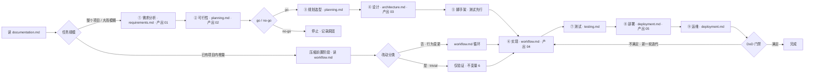

# Fullstack Dev Workflow (fdw)

一套**自包含的软件开发工程化规范**与 AI 编码工作流，以 **skill** 形式存在。它把完整的软件工程方法论——需求分析、可行性研究、技术选型、架构设计、测试驱动开发、代码审查、安全审计、部署运维——固化成一组可执行的分诊路由（reference 文件）。任何开发任务（新项目、新功能、修 bug、重构、理解代码、设计接口、审查、写文档、提交）都能通过 `SKILL.md` 的入口分诊找到它专属的执行规范。

> 本仓库是可分发的 skill 工程：技能本体在 [`.agents/skills/fdw/`](.agents/skills/fdw/SKILL.md)，由 CI 打包为 `fdw.zip` 随 Release 分发；[网页](https://linanwanttodo.github.io/fullstack-dev-workflow/) 提供介绍与安装指引；本 README 用中英双语完整说明。

---

## 目录

- [快速开始](#快速开始)
- [设计动机](#设计动机)
- [AI 工作准则（八荣八耻）](#ai-工作准则八荣八耻)
- [核心不变量](#核心不变量)
- [软件工程理论体系](#软件工程理论体系)
  - [全生命周期（9 阶段）](#全生命周期9-阶段)
  - [任务分诊路由](#任务分诊路由)
  - [工程方法论要点](#工程方法论要点)
- [项目结构](#项目结构)
- [测试与评测](#测试与评测)
- [本地开发](#本地开发)
- [License](#license)

---

## 快速开始

### 方式一 · 手动

1. 下载 `fdw.zip`：<https://github.com/linanwanttodo/fullstack-dev-workflow/releases/latest/download/fdw.zip>
2. 解压到技能目录：

   ```bash
   mkdir -p ~/.agents/skills && \
   curl -sL -o fdw.zip https://github.com/linanwanttodo/fullstack-dev-workflow/releases/latest/download/fdw.zip && \
   unzip -q fdw.zip -d ~/.agents/skills && \
   rm fdw.zip && \
   ls ~/.agents/skills/fdw/SKILL.md ~/.agents/skills/fdw/references/entry.md
   ```

3. 确认 `SKILL.md` 与 `references/`（16 份引用文档）就位。

### 方式二 · 交给 AI

把下面这段提示词复制给你任意支持 skills 的 AI（opencode / Codex / Claude 等），它会自动完成下载、解压与验证：

```text
请帮我安装 fullstack-dev-workflow (fdw) 这个 skill，请执行：
1. 下载 https://github.com/linanwanttodo/fullstack-dev-workflow/releases/latest/download/fdw.zip
2. 解压到 ~/.agents/skills/fdw/
3. 验证 ~/.agents/skills/fdw/SKILL.md 与 ~/.agents/skills/fdw/references/ 均存在
4. 报告安装结果
```

安装后，在任何开发任务中该 skill 会自动生效：先读 `references/entry.md` 分类请求 → 按意图路由到对应 reference → 按 reference 执行 → 验证后才报告完成。

---

## 设计动机

大多数编码 Agent 拿到任务时会直接跳到写代码。这个 skill 解决的是：**什么时候该走什么流程、读什么规范、输出什么产物**。

- **分诊优先**：任何请求先被 `entry.md` 归类为核心意图，再路由到最匹配的 reference——每个 reference 自包含、可独立使用。
- **流程按规模伸缩**：整个项目走 9 阶段全生命周期；已有项目内的增量改动压缩进 per-change 工作流（`workflow.md`）；纯机械改动（改名、注释、格式化）只需验证，不需要计划和测试。
- **行为准则兜底**：在技术流程之上，`AI work principles`（八荣八耻）约束 AI 的工作态度——认真查阅而非猜测接口、寻求确认而非模糊执行、诚实承认无知而非假装理解。

---

## AI 工作准则（八荣八耻）

在核心不变量之上，**每个任务、每个阶段**都适用的行为准则。荣誉侧是默认行为；耻辱侧是绝不能做的事。每条都锚定到执行它的 reference 文件：

> 以暗猜接口为耻，以认真查阅为荣
> 以模糊执行为耻，以寻求确认为荣
> 以盲想业务为耻，以人类确认为荣
> 以创造接口为耻，以复用现有为荣
> 以跳过验证为耻，以主动测试为荣
> 以破坏架构为耻，以遵循规范为荣
> 以假装理解为耻，以诚实无知为荣
> 以盲目修改为耻，以谨慎重构为荣

| # | 荣誉（Honor） | 耻辱（Shame） | 锚点 |
|---|---|---|---|
| 1 | **认真查阅**（Consult） | **暗猜接口**（Guessing APIs） | `workflow.md` Phase 0.1 — 动手前先读真实接口与代码，绝不臆测 API 行为 |
| 2 | **寻求确认**（Seek confirmation） | **模糊执行**（Vague execution） | `workflow.md` Phase 0.2 — 意图不明时先确认目标，不靠猜测推进 |
| 3 | **人类确认**（Human confirmation） | **盲想业务**（Assuming the business） | `workflow.md` Phase 0.2 + `requirements.md` — 业务意图与用户确认，绝不静默发明需求 |
| 4 | **复用现有**（Reuse existing） | **创造接口**（Inventing new） | `workflow.md` Phase 0.1 + `architecture.md` — 优先复用已有接口与代码，新接口是最后手段 |
| 5 | **主动测试**（Test proactively） | **跳过验证**（Skipping verification） | `testing.md` + 不变量 5 — 测试并验证，绝不在未运行检查时宣称完成 |
| 6 | **遵循规范**（Follow conventions） | **破坏架构**（Breaking architecture） | `code-standards.md` + 不变量 3 — 遵守项目规范与架构边界 |
| 7 | **诚实无知**（Honest ignorance） | **假装理解**（Faking understanding） | `security.md` + `debugging.md` — 明确说出自己不知道什么，而非装作知道 |
| 8 | **谨慎重构**（Careful refactoring） | **盲目修改**（Blind modification） | `refactoring.md` + `debugging.md` — 以 before/after 设计有意识地修改；修根因，不修症状 |

---

## 核心不变量

无论任务类型，以下六条**永远适用**：

1. **先计划后编码**（Plan before code） — 写实现代码前先理解任务、上下文与设计意图。
2. **正确性优先于速度**（Correctness over speed） — 正确、可验证、可维护 > 快而脆。
3. **为可维护性设计**（Design for maintainability） — SOLID（尤其 SRP 与 DIP）、高内聚低耦合、面向接口编程、依赖注入。
4. **测试保护行为**（Tests protect behavior） — 新功能与 bug 修复带测试，除非用户明确豁免。
5. **验证后才宣称完成**（Verify before claiming done） — 实际运行验证命令并确认输出，再报告成功。
6. **流程与规模匹配**（Proportionate process） — 仅当改动是机械、低风险、结构不变时视为 trivial（改名、注释/格式修复、无行为变更的重组）。判断标准：用户能否观察到差异——值、消息、时序、决策、输出——能观察到就是行为变更，走完整流程。改一行常量、改配置都是行为变更。

---

## 软件工程理论体系

### 全生命周期（9 阶段）

整个项目或大而边界模糊的功能，按顺序执行以下阶段；已有项目内的增量工作直接跳转 `workflow.md` 并压缩前置阶段。启动前先读 `documentation.md`（它定义每个阶段写入的 `docs/` 目录结构）。



网页版流程图由页面直接渲染（含每个阶段的完整要点），流程定义源文件在 `web/public/lifecycle-zh.puml`（PlantUML）。

| 阶段 | 内容 | Reference | 产出 |
|---|---|---|---|
| 1. **需求分析** Requirements | 问题、范围、人物画像、功能/非功能需求、用户故事 + 验收标准、成功指标、MoSCoW 优先级 | `requirements.md` | `docs/01-requirements/` |
| 2. **可行性** Feasibility | 技术/经济/运营/法律/工期可行性、风险、明确的 go/no-go | `planning.md` | `docs/02-planning/` |
| 3. **规划与技术选型** Planning & tech selection | 技术栈 + 记录理由（ADR）、任务分解、里程碑、风险登记 | `planning.md` | `docs/02-planning/` |
| 4. **设计** Design | 架构、分层、API 契约、数据库 schema、数据流、UI/UX、安全设计 | `architecture.md`（+`frontend-design.md`, `security.md`） | `docs/03-architecture/` |
| 5. **脚手架** Scaffold | 版本控制、技术栈骨架、`docs/` 目录、测试脚手架；"一个通过的测试"是开始功能开发的地板 | — | 仓库骨架 |
| 6. **实现** Implementation | per-change 循环：探索 → 澄清 → 设计 → 测试先行 → 实现 → 自审 → 验证 → 提交 | `workflow.md` | `docs/04-modules/`（模块深入文档保持最新） |
| 7. **测试** Testing | 单元 → 集成 → E2E，外加性能与安全检查 | `testing.md` | 测试套件 |
| 8. **部署** Deployment | CI/CD、环境、回滚计划、冒烟测试、密钥管理 | `deployment.md` | `docs/05-deployment/` |
| 9. **运维** Operation & maintenance | 监控、错误跟踪、反馈回路；每个新变更开启新一轮迭代 | `deployment.md` | 各文档保持同步 |

**项目级完成定义（Definition of Done）**：每个 Must 需求都有通过的测试并经验证；应用端到端可运行；构建、测试、安全扫描在 CI 中通过；部署与回滚已演练；`docs/` 各目录准确且最新。

### 任务分诊路由

`entry.md` 是第一道关卡——任何请求先分类再路由。下表是面向人类读者的摘要，**`references/entry.md` 是唯一权威路由表**（改路由只改它，本摘要与 `SKILL.md` 均不维护副本）：

| 意图（用户要求…） | 路由（读这些） |
|---|---|
| debug / 修复异常行为 / 为什么 X 坏了 | `debugging.md` |
| 性能 / 慢 / 优化 / 分析 | `debugging.md`（性能分析章节） |
| 部署 / CI-CD / 发布 / 运维 | `deployment.md` |
| 理解 / 解释 / 模块概述 / X 怎么工作的 | `understanding.md` |
| 写或更新文档 / 架构文档 / 图表 | `documentation.md` |
| 安全 / 审计 / 是否安全 | `security.md` |
| 提交 / 写提交信息 / git | `git-commit.md` |
| 审查 / 审计变更 / 检查 PR | `code-review.md`（含 standards/security/commit 全链路） |
| UI / 前端 / 美化 / 设计页面 | `frontend-design.md` |
| 重构 / 清理代码 / 改善结构 | `refactoring.md` |
| 写测试 / 增加覆盖率 | `testing.md` |
| 新功能 / 构建东西 | `workflow.md`, `architecture.md`, `testing.md` |
| 架构 / API / 数据库设计 | `architecture.md` |
| 技术选型 / 可行性 / 计划 / 估算 | `planning.md` |
| 整个项目 / 从零构建 | 全生命周期（`SKILL.md`） |
| 注释 / 代码风格 / 命名约定 | `code-standards.md` |
| 机械改动 / trivial（改名、注释/格式修正、无行为变更重组） | 无需 reference——按不变量 6 走：无计划无测试，仅验证 |

规则：

- **路由到最窄匹配** — 单一意图路由到其专属 reference，自包含完成该任务；reference 内部按需指向关联文件。
- **歧义请求** — 选最可能的路径，一句话声明假设，继续执行；被纠正则重新分诊。
- **混合意图**（如"修这个 bug 顺便查安全"）— 先处理主意图，再按序处理次意图，不合并成半个流程。
- **独立可用** — 每个 reference 都能单独使用；只有真正的整体项目才需要全生命周期。

### 工程方法论要点

**测试驱动开发（testing.md）** — 测试金字塔：单元（最多）→ 集成 → E2E（最少），外加契约测试（有 API 契约时）与性能/安全扫描（CI 中运行）。每个验收标准映射到至少一个测试，选金字塔中最便宜、最能捕获它的层级。TDD 循环：RED（写失败测试）→ 确认因正确原因失败 → GREEN（最小实现）→ REFACTOR（保持测试通过）。

**系统化调试（debugging.md）** — 复现 → 逐字读错误 → 最多两三条假设并用代码库验证 → 测试假设（绝不明目凭直觉"修"）→ 追问 why 直到根因 → 修根因不修症状 → 加回归测试 → 验证 → 提交。含性能分析章节：测量 → 基线 → 定位瓶颈 → 假设 → 修复 → 验证。

**安全重构（refactoring.md）** — 重构改结构不改行为。先清点职责/API 面/副作用 → 产出显式 before/after 设计 → 用特征测试钉住行为 → 小步、行为保持技术 → 每一步独立可提交、带验证点。

**架构标准（architecture.md）** — SOLID、高内聚低耦合、面向接口编程、依赖注入、分层与边界、接口设计清单、API 契约先行、显式错误模型设计（异常 vs 类型化结果 vs 校验错误）、并发与数据一致性（识别共享可变状态、选择最简正确模型、边界处协调）、数据库 schema 设计（ER 先行、版本化可回滚迁移）、UI/UX 设计（加载/空/错误状态显式设计）、常见陷阱（god class、服务定位器、过早抽象、领域耦合框架）。

**需求分析（requirements.md）** — 把模糊请求变成有文档、可测试的契约，发生在任何设计或代码之前。问题陈述、范围（In/Out/约束）、人物画像、功能/非功能需求、**可追踪性**（每条需求 ID 映射到设计与测试，无测试的需求不算完成）、**变更管理**（签收后变更需记录原因与影响、更新基线、与用户复确认）、MoSCoW 优先级。产出用户签收的需求摘要。

**安全清单（security.md）** — 语言无关危险模式（反序列化、YAML、命令注入、XSS、弱加密、TLS、XML、GitHub Actions）、输入处理、密钥、认证，外加四平台章节：Android（导出组件、Intent 重定向、FileProvider、WebView 文件访问、Keystore、PendingIntent FLAG_IMMUTABLE、deep link）、iOS/macOS（Keychain 可访问性、数据保护、ATS、Hardened Runtime、entitlements）、桌面含 Electron/Tauri（sandbox + contextIsolation、IPC 校验、导航控制、Tauri capabilities/updater key）、Web（DOM XSS、SRI、CSRF、CSP、CORS、cookie 标志、JWT、文件上传、SSRF）。**威胁建模（STRIDE）先行**。审查规则：不确定是否引入漏洞时必须明说并标记，不得假设安全。

**前端设计（frontend-design.md）** — 设计计划先行（配色、字体、布局、signature），禁止模式（浮动元素、渐变、emoji、霓虹、侧边栏条状框、liquid glass），UX 质量底线，文案，图片 vs 代码原生决策。

**部署运维（deployment.md）** — 环境、CI/CD 管道、回滚计划、冒烟测试、密钥管理、监控；Web / Android / iOS / 桌面四平台章节（签名、商店、自动更新）。

**文档标准（documentation.md）** — `docs/` 目录结构（01-requirements 到 05-deployment）、各阶段文档模板、Mermaid 图规则、**文档与代码同步策略**（文档与所描述的代码在同一次变更中更新）。判断阈值：改动公开面/依赖/数据模型/关键流程/架构/API/契约/schema/部署配置 → 必须更新；机械低风险改动（改名、注释、格式）→ 可选。

**代码审查（code-review.md）** — 多视角审查、置信度评分（≥80）、误报过滤、结构化输出格式，含代码规范 / 安全 / 提交三个通过标准。

**提交规范（git-commit.md）** — Conventional Commits 格式与提交卫生。

**理解项目（understanding.md）** — 读文档 → 映射代码 → 追踪数据流 → 输出结构化总结；纯信息任务，不改代码。

**计划与技术选型（planning.md）** — 可行性判定、技术选型 + 理由（ADR：选择/放弃/权衡）、任务分解、里程碑（含各自完成定义）、**估算**（S/M/L 或点数、时间范围、不确定性、对照实际复盘）、依赖与排序、风险登记。

---

## 项目结构

```
fullstack-dev-workflow/
├── .agents/skills/fdw/            # 技能本体（单一事实来源）
│   ├── SKILL.md                   # 入口：核心不变量、AI 工作准则、9 阶段生命周期、任务路由、引用表
│   ├── README.md                  # 技能的详细中文说明（八荣八耻原文、路由表、方法论要点）
│   └── references/                # 16 份引用文档
│       ├── entry.md               # 入口分诊：任何请求先分类再路由
│       ├── workflow.md            # per-change 循环（探索→澄清→设计→测试先行→实现→自审→验证→提交）
│       ├── understanding.md       # 理解项目/模块/功能
│       ├── requirements.md        # 需求分析 + 可追踪性 + 变更管理
│       ├── planning.md            # 可行性、技术选型、估算、里程碑、风险
│       ├── architecture.md        # SOLID、接口设计、错误模型、并发、数据库、UI/UX
│       ├── documentation.md       # docs/ 结构、文档模板、同步策略
│       ├── frontend-design.md     # 前端设计标准、禁止模式
│       ├── testing.md             # 测试金字塔、TDD 循环
│       ├── debugging.md           # 系统化调试 + 性能分析
│       ├── refactoring.md         # 安全重构、before/after 设计
│       ├── code-standards.md      # 命名、注释、格式、错误处理、审查清单
│       ├── code-review.md         # 多视角审查、置信度评分
│       ├── git-commit.md          # Conventional Commits
│       ├── security.md            # 危险模式 + 威胁建模 + 四平台安全章节
│       └── deployment.md          # 部署运维 + 四平台章节
├── tests/                         # 可重复评测机制（触发/路由/执行三份评测 + 种子工程）
│   ├── README.md                  # 评测总览与标准流程
│   ├── TRIGGER_EVAL.md            # description 触发评测（20 条含近失例）
│   ├── ROUTING_EVAL.md            # 分诊路由评测（19 条）
│   ├── EXECUTION_EVAL.md          # 执行层评测（3 场景：修 bug/TDD 新功能/安全审计）
│   └── fixtures/                  # 执行评测的种子工程（自带活 bug 与漏洞）
├── web/                           # 介绍网页（Vite + TypeScript，中英双语）
│   ├── public/                    # 静态资源；lifecycle-zh.puml / lifecycle-en.puml（流程源定义，PlantUML）
│   └── src/                       # i18n.ts / main.ts / style.css（流程图由页面直接渲染）
├── .github/workflows/
│   ├── package.yml                # 打包 fdw.zip → artifact；打 tag 时发布 Release 资产
│   └── pages.yml                  # 构建 web/ → GitHub Pages
├── README.md / README.en.md       # 本说明（中英双语）
└── LICENSE                        # MIT
```

### 引用速查

| Reference | 一句话内容 | 适用任务 |
|---|---|---|
| `entry.md` | 入口分诊 | 任何请求的第一站 |
| `workflow.md` | per-change 开发循环 | 新功能、增量改动 |
| `understanding.md` | 读文档、映射代码、追踪流程 | 理解/解释/项目概述 |
| `requirements.md` | 需求契约 + 追踪 + 变更管理 | 需求分析 |
| `planning.md` | 可行性/选型/估算/里程碑 | 计划、技术选型 |
| `architecture.md` | 架构与接口设计标准 | 架构/API/数据库设计 |
| `documentation.md` | docs/ 结构与同步策略 | 写/更新文档 |
| `frontend-design.md` | 前端设计标准 | UI/前端设计 |
| `testing.md` | 测试金字塔 + TDD | 写测试 |
| `debugging.md` | 系统化调试 + 性能 | 修 bug、性能分析 |
| `refactoring.md` | 安全重构 | 重构/清理 |
| `code-standards.md` | 代码与注释规范 | 代码风格 |
| `code-review.md` | 多视角审查 | 审查变更 |
| `git-commit.md` | 提交规范 | 提交 |
| `security.md` | 安全清单 + 平台章节 | 安全审计 |
| `deployment.md` | 部署运维 + 平台章节 | 部署/CI-CD |

---

## 测试与评测

`tests/` 下是一套**可重复的评测机制**，任何对 `SKILL.md` / `references/` 的改动都应过一遍防回归：

- `TRIGGER_EVAL.md` — description 触发评测：20 条真实请求（含刻意近失例），验证 skill 是否在该触发时触发、不该触发时不触发。
- `ROUTING_EVAL.md` — 分诊路由评测：19 条请求逐条验证路由到正确且唯一的 reference。
- `EXECUTION_EVAL.md` — 执行层评测：修 bug / TDD 新功能 / 安全审计 3 个场景，在种子工程上走完整流程，收集摩擦点。
- `fixtures/` — 执行评测的种子工程（自带一个活的舍入 bug 和一个命令注入漏洞）。

历史：2026-08-18 首轮跑通，发现并修复 12 项问题（路由表漂移、trivial/无意图无路由、JWT 功能漏 security、docs 同步无比例缩放、security 清单无纯函数豁免、description 触发边界等）。详见各评测文件底部"历史回归"。

---

## 本地开发

```bash
# 网页本地开发（Vite dev server）
cd web && npm install && npm run dev

# 网页构建（产出 dist/，流程图由页面直接渲染）
cd web && npm run build

# 本地模拟 CI 打包（验证 zip 结构）
cd .agents/skills && zip -r fdw.zip fdw && unzip -l fdw.zip | head
```

CI 自动流程：推 `main` → `package.yml` 打包 `fdw.zip` 并上传 artifact，`pages.yml` 构建并部署网页；打 tag（如 `git tag v0.1.0 && git push origin v0.1.0`）→ 发布带 `fdw.zip` 的 Release。

---

## License

[MIT](LICENSE) © 2026 [linanwanttodo](https://github.com/linanwanttodo)